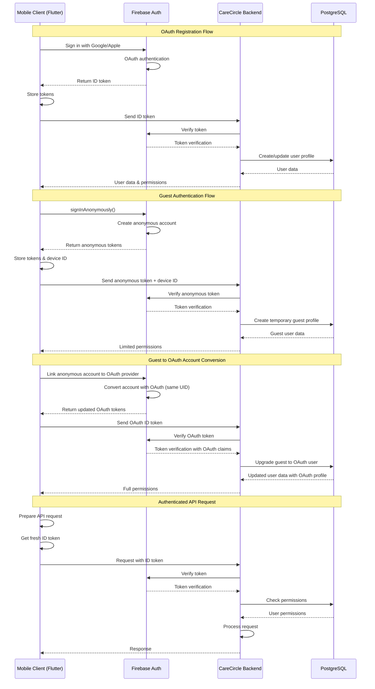

# Firebase Authentication Integration Flow

This document details the authentication flow between the CareCircle mobile application, Firebase Authentication, and the CareCircle backend service.

## Overview

CareCircle implements a streamlined authentication system using Firebase Authentication with OAuth providers and guest mode support:

1. **OAuth Authentication**: Google and Apple sign-in for registered users
2. **Guest Mode**: Anonymous authentication for trial/demo access
3. **Secure Communication**: Firebase ID tokens for backend authentication
4. **Healthcare Compliance**: HIPAA-compliant authentication flows

## Architecture Diagram

```
┌─────────────────┐     ┌───────────────────┐     ┌────────────────────┐
│                 │     │                   │     │                    │
│  Mobile Client  │────▶│  Firebase Auth    │────▶│  CareCircle API    │
│  (Flutter)      │     │                   │     │  (NestJS Backend)  │
│                 │◀────│                   │◀────│                    │
└─────────────────┘     └───────────────────┘     └────────────────────┘
        │                         │                         │
        │                         │                         │
        ▼                         ▼                         ▼
┌─────────────────┐     ┌───────────────────┐     ┌────────────────────┐
│                 │     │                   │     │                    │
│ Local Storage   │     │ Firebase Firestore│     │ PostgreSQL         │
│ (User Tokens)   │     │ (User Metadata)   │     │ (User Profiles)    │
│                 │     │                   │     │                    │
└─────────────────┘     └───────────────────┘     └────────────────────┘
```

## Sequence Diagram

The following sequence diagram illustrates the detailed authentication flows between the mobile client, Firebase Authentication, and the CareCircle backend:



## Detailed Authentication Flow

### 1. OAuth User Authentication Flow

1. **OAuth Provider Selection**
   - User selects Google or Apple sign-in
   - Mobile client initiates OAuth flow with selected provider

2. **Firebase OAuth Authentication**
   - Firebase handles OAuth provider authentication
   - Creates or links user account in Firebase Auth
   - Generates Firebase ID tokens with OAuth claims
   - Returns tokens to mobile client

3. **Token Processing in Mobile Client**
   - Client securely stores Firebase authentication tokens
   - Retrieves Firebase ID token containing OAuth profile data

4. **Backend Validation**
   - Mobile sends Firebase ID token to CareCircle backend
   - Backend uses Firebase Admin SDK to verify token and OAuth claims
   - Backend creates or updates user profile in PostgreSQL with OAuth data
   - Backend returns user-specific data and permissions

5. **Session Establishment**
   - Mobile client maintains tokens for future requests
   - Refreshes tokens automatically using Firebase SDK

### 2. Guest User Flow

1. **Guest Login Request**
   - User selects "Continue as Guest" option
   - App generates device identifier for tracking

2. **Anonymous Firebase Authentication**
   - Mobile client calls Firebase Auth SDK for anonymous authentication
   - Firebase creates anonymous user account
   - Firebase returns anonymous user tokens

3. **Backend Processing**
   - Mobile sends anonymous ID token to backend
   - Backend validates token and creates temporary guest profile
   - Backend assigns limited permissions to guest account
   - Device identifier is stored to prevent multiple guest accounts

4. **Guest User Experience**
   - Guest user can access limited functionality
   - App periodically suggests account creation
   - All guest data is maintained for potential future conversion

### 3. Account Conversion Flow

1. **Guest-to-OAuth Conversion**
   - Guest user initiates account creation process
   - User selects Google or Apple OAuth provider

2. **Firebase Account Linking**
   - Firebase links anonymous account to OAuth provider
   - Preserves the same Firebase UID during conversion

3. **Backend Account Upgrade**
   - Mobile client sends new ID token to backend
   - Backend recognizes the same UID with new authentication method
   - Backend upgrades user profile from guest to registered
   - All existing data is preserved and associated with the new account

### 4. Authenticated Request Flow

1. **Preparing API Request**
   - Mobile client prepares API request to backend
   - Client retrieves current Firebase ID token

2. **Sending Authenticated Request**
   - Client adds Firebase ID token to request header:
     ```
     Authorization: Bearer <firebase_id_token>
     ```

3. **Backend Authentication Processing**
   - NestJS auth guard intercepts incoming request
   - Guard extracts token from Authorization header
   - Firebase Admin SDK verifies token integrity and expiration
   - User's Firebase UID extracted from verified token

4. **Authorization**
   - Backend retrieves user profile and permissions from database
   - Backend validates user has appropriate permissions for requested operation
   - Request is either processed or rejected based on permissions

5. **Response**
   - Backend returns appropriate response with any user-specific data
   - Mobile client processes response based on success/failure

### 5. Token Refresh Flow

1. **Token Expiration Detection**
   - Mobile client detects expired Firebase token (default expiration: 1 hour)
   - Client initiates token refresh before making API calls

2. **Token Refresh**
   - Firebase SDK automatically refreshes tokens when needed
   - New ID token is retrieved for API communications

3. **Continued Operation**
   - API calls proceed with the new token
   - Refresh process is transparent to the user

## Code Implementation

### Mobile Client (Flutter)

```dart
// Initialize Firebase
await Firebase.initializeApp(
  options: DefaultFirebaseOptions.currentPlatform,
);

// Sign up with Google OAuth
Future<UserCredential> signUpWithGoogle() async {
  try {
    final GoogleSignInAccount? googleUser = await GoogleSignIn().signIn();
    final GoogleSignInAuthentication? googleAuth = await googleUser?.authentication;

    final credential = GoogleAuthProvider.credential(
      accessToken: googleAuth?.accessToken,
      idToken: googleAuth?.idToken,
    );

    final UserCredential userCredential = await FirebaseAuth.instance
        .signInWithCredential(credential);

    // Get Firebase ID token for backend communication
    final String idToken = await userCredential.user!.getIdToken();

    // Register with backend
    await registerWithBackend(idToken);

    return userCredential;
  } catch (e) {
    // Handle OAuth errors
    rethrow;
  }
}

// Sign in with Apple OAuth
Future<UserCredential> signInWithApple() async {
  try {
    final appleCredential = await SignInWithApple.getAppleIDCredential(
      scopes: [
        AppleIDAuthorizationScopes.email,
        AppleIDAuthorizationScopes.fullName,
      ],
    );

    final oauthCredential = OAuthProvider("apple.com").credential(
      idToken: appleCredential.identityToken,
      accessToken: appleCredential.authorizationCode,
    );

    final UserCredential userCredential = await FirebaseAuth.instance
        .signInWithCredential(oauthCredential);

    // Get Firebase ID token for backend communication
    final String idToken = await userCredential.user!.getIdToken();

    // Authenticate with backend
    await authenticateWithBackend(idToken);

    return userCredential;
  } catch (e) {
    // Handle Apple OAuth errors
    rethrow;
  }
}

// Anonymous (guest) authentication
Future<UserCredential> signInAnonymously() async {
  try {
    final UserCredential userCredential = await FirebaseAuth.instance.signInAnonymously();

    // Get device identifier
    final String deviceId = await getDeviceId();

    // Get Firebase ID token
    final String idToken = await userCredential.user!.getIdToken();

    // Register guest with backend
    await registerGuestWithBackend(idToken, deviceId);

    return userCredential;
  } catch (e) {
    // Handle errors
    rethrow;
  }
}

// Convert guest to OAuth account
Future<UserCredential> convertGuestToOAuth() async {
  try {
    // Get current anonymous user
    final User currentUser = FirebaseAuth.instance.currentUser!;

    // Get Google OAuth credential
    final GoogleSignInAccount? googleUser = await GoogleSignIn().signIn();
    final GoogleSignInAuthentication? googleAuth = await googleUser?.authentication;

    final AuthCredential credential = GoogleAuthProvider.credential(
      accessToken: googleAuth?.accessToken,
      idToken: googleAuth?.idToken,
    );

    // Link anonymous account with OAuth credentials
    final UserCredential userCredential = await currentUser.linkWithCredential(credential);

    // Get new Firebase ID token with OAuth claims
    final String idToken = await userCredential.user!.getIdToken(true);

    // Update backend with OAuth account status
    await upgradeAccountWithBackend(idToken);

    return userCredential;
  } catch (e) {
    // Handle OAuth linking errors
    rethrow;
  }
}

// API call with authentication
Future<http.Response> authenticatedApiCall(String endpoint, {Map<String, dynamic>? body}) async {
  // Get current user
  final User? user = FirebaseAuth.instance.currentUser;

  if (user == null) {
    throw Exception('User not authenticated');
  }

  // Get fresh token
  final String idToken = await user.getIdToken();

  // Make authenticated request
  return http.post(
    Uri.parse('$apiBaseUrl/$endpoint'),
    headers: {
      'Content-Type': 'application/json',
      'Authorization': 'Bearer $idToken',
    },
    body: body != null ? jsonEncode(body) : null,
  );
}
```

### Backend (NestJS)

```typescript
// auth.guard.ts - Authentication Guard
@Injectable()
export class FirebaseAuthGuard implements CanActivate {
  constructor(private firebaseAdmin: FirebaseAdminService) {}

  async canActivate(context: ExecutionContext): Promise<boolean> {
    const request = context.switchToHttp().getRequest();
    const authHeader = request.headers.authorization;

    if (!authHeader) {
      throw new UnauthorizedException("No authorization header provided");
    }

    const token = authHeader.split("Bearer ")[1];
    if (!token) {
      throw new UnauthorizedException("Invalid authorization header format");
    }

    try {
      // Verify Firebase ID token
      const decodedToken = await this.firebaseAdmin.auth.verifyIdToken(token);

      // Get user from database or create if doesn't exist
      const user = await this.getUserFromDatabase(decodedToken.uid);

      // Attach user to request for use in controllers
      request.user = user;

      return true;
    } catch (error) {
      throw new UnauthorizedException("Invalid token");
    }
  }

  private async getUserFromDatabase(firebaseUid: string) {
    // Implementation to retrieve or create user in your database
    // ...
  }
}

// user.controller.ts - Example API Endpoints
@Controller("users")
export class UserController {
  constructor(private userService: UserService) {}

  @Post("register")
  @UseGuards(FirebaseAuthGuard)
  async registerUser(@Request() req) {
    // User is already authenticated via Firebase
    // The guard has attached the user to the request
    const firebaseUser = req.user;

    // Create or update user profile with additional information
    return this.userService.createUserProfile(firebaseUser);
  }

  @Post("guest")
  @UseGuards(FirebaseAuthGuard)
  async registerGuestUser(@Request() req, @Body() body: { deviceId: string }) {
    const firebaseUser = req.user;
    const { deviceId } = body;

    // Register guest user with device tracking
    return this.userService.createGuestProfile(firebaseUser, deviceId);
  }

  @Post("upgrade")
  @UseGuards(FirebaseAuthGuard)
  async upgradeGuestAccount(@Request() req) {
    const firebaseUser = req.user;

    // Upgrade guest account to full account
    return this.userService.upgradeGuestToRegistered(firebaseUser);
  }
}
```

## Security Considerations

1. **Token Verification**: All Firebase tokens must be verified by the backend using Firebase Admin SDK.

2. **Role-Based Access Control**:
   - Custom Firebase claims are used to assign the appropriate role
   - Backend validates permissions for each API request

3. **Token Expiration**:
   - Firebase ID tokens expire after 1 hour by default
   - Refresh tokens are used to obtain new ID tokens
   - Backend rejects expired tokens

4. **Device Tracking**:
   - Device identifiers prevent creation of multiple guest accounts
   - Enhances security and prevents abuse of guest mode

5. **Data Isolation**:
   - Guest users have limited access to system features
   - Registered users cannot access other users' data unless explicitly shared

## Related Documents

- [Firebase Authentication System](./feature_UM-010.md)
- [Backend Structure - Authentication and Authorization Flow](../backend_structure.md#4-authentication-and-authorization-flow)
- [Legacy Migration Decisions - Authentication Strategy](../legacy_migration_decisions.md#authentication-strategy)
