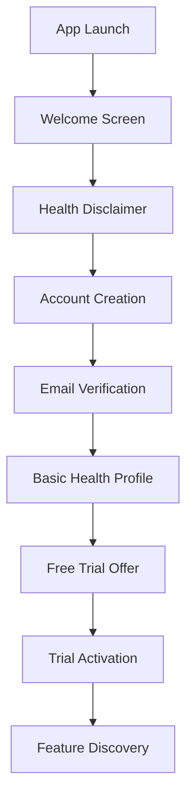

# User Experience Flows for Subscription Management

## Overview

This document outlines the complete user experience flows for subscription management in the CareCircle mobile application, ensuring a seamless and healthcare-appropriate user journey from onboarding to subscription management.

## Onboarding and Trial Flow

### Initial App Launch


### Welcome and Trial Activation
```dart
class OnboardingFlow extends StatefulWidget {
  @override
  Widget build(BuildContext context) {
    return PageView(
      children: [
        WelcomeScreen(
          title: "Welcome to CareCircle",
          subtitle: "Your AI-powered health companion",
          features: [
            "24/7 AI health consultations",
            "Personalized health insights",
            "Medication reminders",
            "Family health tracking"
          ]
        ),
        TrialOfferScreen(
          trialDuration: "7 days free",
          premiumFeatures: [
            "Unlimited AI consultations",
            "Advanced health analytics",
            "Priority support"
          ],
          ctaText: "Start Free Trial"
        ),
        HealthProfileSetup(),
        FeatureDiscoveryTour()
      ]
    );
  }
}
```

### Trial Experience Design
- **Day 1-2**: Basic feature introduction
- **Day 3-4**: Advanced feature showcase
- **Day 5-6**: Personalized health insights
- **Day 7**: Upgrade prompts with trial summary

## Feature Gating and Upgrade Prompts

### Contextual Upgrade Prompts
```dart
class FeatureGateWidget extends StatelessWidget {
  final String featureName;
  final SubscriptionTier requiredTier;
  final int currentUsage;
  final int quotaLimit;
  
  @override
  Widget build(BuildContext context) {
    if (currentUsage >= quotaLimit) {
      return UpgradePromptCard(
        title: "You've reached your limit",
        message: "Upgrade to Premium for unlimited ${featureName}",
        benefits: _getUpgradeBenefits(),
        ctaText: "Upgrade Now",
        onUpgrade: () => _showUpgradeFlow(context)
      );
    }
    
    return FeatureAccessWidget(
      remainingUsage: quotaLimit - currentUsage,
      totalQuota: quotaLimit
    );
  }
}
```

### Smart Upgrade Timing
```dart
class UpgradePromptStrategy {
  static bool shouldShowUpgradePrompt(UserContext context) {
    // Show after positive AI interaction
    if (context.lastAIRating >= 4 && context.sessionCount >= 3) {
      return true;
    }
    
    // Show when approaching quota limit
    if (context.quotaUsagePercentage >= 80) {
      return true;
    }
    
    // Show during high-value feature usage
    if (context.isUsingPremiumFeature) {
      return true;
    }
    
    return false;
  }
}
```

## Subscription Selection and Purchase

### Subscription Plans Screen
```dart
class SubscriptionPlansScreen extends StatelessWidget {
  @override
  Widget build(BuildContext context) {
    return Scaffold(
      appBar: AppBar(title: Text("Choose Your Plan")),
      body: Column(
        children: [
          PlanComparisonHeader(),
          Expanded(
            child: ListView(
              children: [
                PlanCard(
                  plan: SubscriptionPlan.free,
                  isCurrentPlan: true,
                  features: [
                    "5 AI consultations/month",
                    "Basic health tracking",
                    "Community support"
                  ]
                ),
                PlanCard(
                  plan: SubscriptionPlan.premium,
                  isRecommended: true,
                  discount: "Save 20% annually",
                  features: [
                    "Unlimited AI consultations",
                    "Advanced health analytics",
                    "Priority support",
                    "Family sharing (4 members)",
                    "Data export"
                  ]
                ),
                PlanCard(
                  plan: SubscriptionPlan.professional,
                  features: [
                    "All Premium features",
                    "Patient management tools",
                    "Clinical decision support",
                    "EMR integration",
                    "White-label options"
                  ]
                )
              ]
            )
          ),
          SubscriptionFooter()
        ]
      )
    );
  }
}
```

### Payment Method Selection
```dart
class PaymentMethodScreen extends StatefulWidget {
  final SubscriptionPlan selectedPlan;
  
  @override
  Widget build(BuildContext context) {
    return Column(
      children: [
        PlanSummaryCard(plan: selectedPlan),
        PaymentMethodSelector(
          methods: [
            PaymentMethod(
              type: PaymentType.appStore,
              title: "App Store",
              subtitle: "Secure payment via Apple",
              icon: Icons.apple,
              isRecommended: Platform.isIOS
            ),
            PaymentMethod(
              type: PaymentType.googlePlay,
              title: "Google Play",
              subtitle: "Secure payment via Google",
              icon: Icons.android,
              isRecommended: Platform.isAndroid
            ),
            PaymentMethod(
              type: PaymentType.momo,
              title: "MoMo",
              subtitle: "Mobile money payment",
              icon: Icons.phone_android,
              isAvailable: _isInAfricanRegion()
            )
          ]
        ),
        PricingDisclaimer(),
        PurchaseButton(
          onPressed: () => _processPurchase(context)
        )
      ]
    );
  }
}
```

### Purchase Confirmation Flow
```dart
class PurchaseConfirmationFlow {
  static Future<void> processPurchase(
    BuildContext context,
    SubscriptionPlan plan,
    PaymentMethod method
  ) async {
    // Show loading state
    showDialog(
      context: context,
      barrierDismissible: false,
      builder: (_) => PurchaseLoadingDialog()
    );
    
    try {
      // Process payment based on method
      final result = await _processPaymentByMethod(plan, method);
      
      // Update local subscription state
      await SubscriptionService.updateLocalState(result);
      
      // Show success screen
      Navigator.of(context).pushReplacement(
        MaterialPageRoute(
          builder: (_) => PurchaseSuccessScreen(
            plan: plan,
            features: _getUnlockedFeatures(plan)
          )
        )
      );
      
    } catch (error) {
      // Show error handling
      Navigator.of(context).pop();
      _showPurchaseErrorDialog(context, error);
    }
  }
}
```

## Subscription Management

### Account Settings Integration
```dart
class AccountSettingsScreen extends StatelessWidget {
  @override
  Widget build(BuildContext context) {
    return ListView(
      children: [
        UserProfileSection(),
        SubscriptionStatusCard(),
        SettingsSection(
          title: "Subscription",
          items: [
            SettingsItem(
              title: "Manage Subscription",
              subtitle: "View plan, billing, and usage",
              onTap: () => Navigator.push(
                context,
                MaterialPageRoute(
                  builder: (_) => SubscriptionManagementScreen()
                )
              )
            ),
            SettingsItem(
              title: "Billing History",
              subtitle: "View payment history and receipts",
              onTap: () => _showBillingHistory(context)
            ),
            SettingsItem(
              title: "Referral Program",
              subtitle: "Invite friends and earn rewards",
              onTap: () => _showReferralScreen(context)
            )
          ]
        ),
        HealthDataSection(),
        PrivacySection(),
        SupportSection()
      ]
    );
  }
}
```

### Subscription Status Dashboard
```dart
class SubscriptionStatusCard extends StatelessWidget {
  @override
  Widget build(BuildContext context) {
    return FutureBuilder<SubscriptionStatus>(
      future: SubscriptionService.getStatus(),
      builder: (context, snapshot) {
        if (!snapshot.hasData) return LoadingCard();
        
        final status = snapshot.data!;
        
        return Card(
          child: Padding(
            padding: EdgeInsets.all(16),
            child: Column(
              crossAxisAlignment: CrossAxisAlignment.start,
              children: [
                Row(
                  children: [
                    Icon(
                      _getStatusIcon(status.tier),
                      color: _getStatusColor(status.tier)
                    ),
                    SizedBox(width: 8),
                    Text(
                      _getTierDisplayName(status.tier),
                      style: Theme.of(context).textTheme.titleMedium
                    ),
                    Spacer(),
                    if (status.tier != SubscriptionTier.professional)
                      TextButton(
                        onPressed: () => _showUpgradeOptions(context),
                        child: Text("Upgrade")
                      )
                  ]
                ),
                SizedBox(height: 8),
                if (status.isActive) ...[
                  Text("Next billing: ${_formatDate(status.nextBillingDate)}"),
                  SizedBox(height: 8),
                  UsageProgressIndicator(
                    features: status.featureUsage
                  )
                ] else ...[
                  Text(
                    "Subscription expired",
                    style: TextStyle(color: Colors.red)
                  ),
                  SizedBox(height: 8),
                  ElevatedButton(
                    onPressed: () => _showReactivationFlow(context),
                    child: Text("Reactivate")
                  )
                ]
              ]
            )
          )
        );
      }
    );
  }
}
```

## Referral System User Flow

### Referral Dashboard
```dart
class ReferralDashboard extends StatelessWidget {
  @override
  Widget build(BuildContext context) {
    return Scaffold(
      appBar: AppBar(title: Text("Invite Friends")),
      body: Column(
        children: [
          ReferralStatsCard(),
          ReferralCodeSection(),
          ShareOptionsGrid(),
          ReferralHistoryList(),
          RewardsSection()
        ]
      )
    );
  }
}

class ReferralStatsCard extends StatelessWidget {
  @override
  Widget build(BuildContext context) {
    return Card(
      child: Padding(
        padding: EdgeInsets.all(16),
        child: Row(
          mainAxisAlignment: MainAxisAlignment.spaceAround,
          children: [
            StatColumn(
              title: "Invited",
              value: "12",
              subtitle: "friends"
            ),
            StatColumn(
              title: "Joined",
              value: "8",
              subtitle: "successfully"
            ),
            StatColumn(
              title: "Rewards",
              value: "3",
              subtitle: "months free"
            )
          ]
        )
      )
    );
  }
}
```

### Share Flow
```dart
class ReferralShareFlow {
  static Future<void> shareReferralCode(
    BuildContext context,
    String referralCode
  ) async {
    final shareOptions = [
      ShareOption(
        title: "WhatsApp",
        icon: Icons.message,
        onTap: () => _shareViaWhatsApp(referralCode)
      ),
      ShareOption(
        title: "SMS",
        icon: Icons.sms,
        onTap: () => _shareViaSMS(referralCode)
      ),
      ShareOption(
        title: "Email",
        icon: Icons.email,
        onTap: () => _shareViaEmail(referralCode)
      ),
      ShareOption(
        title: "Copy Link",
        icon: Icons.copy,
        onTap: () => _copyToClipboard(referralCode)
      )
    ];
    
    showModalBottomSheet(
      context: context,
      builder: (_) => ShareOptionsSheet(options: shareOptions)
    );
  }
  
  static String _generateShareMessage(String referralCode) {
    return '''
🏥 Join me on CareCircle - Your AI Health Assistant!

Get personalized health insights, medication reminders, and 24/7 AI health consultations.

Use my referral code: $referralCode
Download: https://carecircle.app/ref/$referralCode

You'll get 30 days free premium access!
    ''';
  }
}
```

## Error Handling and Recovery

### Payment Failure Recovery
```dart
class PaymentErrorHandler {
  static void handlePaymentError(
    BuildContext context,
    PaymentError error
  ) {
    switch (error.type) {
      case PaymentErrorType.cardDeclined:
        _showCardDeclinedDialog(context, error);
        break;
      case PaymentErrorType.insufficientFunds:
        _showInsufficientFundsDialog(context, error);
        break;
      case PaymentErrorType.networkError:
        _showNetworkErrorDialog(context, error);
        break;
      case PaymentErrorType.serverError:
        _showServerErrorDialog(context, error);
        break;
      default:
        _showGenericErrorDialog(context, error);
    }
  }
  
  static void _showCardDeclinedDialog(
    BuildContext context,
    PaymentError error
  ) {
    showDialog(
      context: context,
      builder: (_) => AlertDialog(
        title: Text("Payment Declined"),
        content: Column(
          mainAxisSize: MainAxisSize.min,
          children: [
            Text("Your payment method was declined."),
            SizedBox(height: 16),
            Text("What would you like to do?")
          ]
        ),
        actions: [
          TextButton(
            onPressed: () => _tryDifferentPaymentMethod(context),
            child: Text("Try Different Method")
          ),
          TextButton(
            onPressed: () => _contactSupport(context),
            child: Text("Contact Support")
          ),
          ElevatedButton(
            onPressed: () => _retryPayment(context),
            child: Text("Retry")
          )
        ]
      )
    );
  }
}
```

### Subscription Recovery Flow
```dart
class SubscriptionRecoveryFlow {
  static Future<void> handleExpiredSubscription(
    BuildContext context,
    SubscriptionStatus status
  ) async {
    final shouldReactivate = await showDialog<bool>(
      context: context,
      builder: (_) => ReactivationDialog(
        expiredPlan: status.tier,
        lastBillingDate: status.lastBillingDate
      )
    );
    
    if (shouldReactivate == true) {
      await _showReactivationFlow(context, status);
    }
  }
  
  static Widget ReactivationDialog({
    required SubscriptionTier expiredPlan,
    required DateTime lastBillingDate
  }) {
    return AlertDialog(
      title: Text("Reactivate Subscription"),
      content: Column(
        mainAxisSize: MainAxisSize.min,
        children: [
          Text("Your ${_getTierName(expiredPlan)} subscription expired."),
          SizedBox(height: 16),
          Text("Reactivate to restore:"),
          ...expiredPlan.features.map((feature) => 
            ListTile(
              leading: Icon(Icons.check, color: Colors.green),
              title: Text(feature),
              dense: true
            )
          )
        ]
      ),
      actions: [
        TextButton(
          onPressed: () => Navigator.of(context).pop(false),
          child: Text("Not Now")
        ),
        ElevatedButton(
          onPressed: () => Navigator.of(context).pop(true),
          child: Text("Reactivate")
        )
      ]
    );
  }
}
```

## Accessibility and Inclusive Design

### Accessibility Features
```dart
class AccessibleSubscriptionUI {
  static Widget buildAccessiblePlanCard(SubscriptionPlan plan) {
    return Semantics(
      label: "Subscription plan: ${plan.name}",
      hint: "Double tap to select this plan",
      child: Card(
        child: InkWell(
          onTap: () => _selectPlan(plan),
          child: Padding(
            padding: EdgeInsets.all(16),
            child: Column(
              children: [
                Text(
                  plan.name,
                  style: TextStyle(
                    fontSize: 18,
                    fontWeight: FontWeight.bold
                  ),
                  semanticsLabel: "Plan name: ${plan.name}"
                ),
                Text(
                  "\$${plan.price}/month",
                  style: TextStyle(fontSize: 24),
                  semanticsLabel: "Price: ${plan.price} dollars per month"
                ),
                ...plan.features.map((feature) => 
                  Semantics(
                    label: "Feature: $feature",
                    child: ListTile(
                      leading: Icon(Icons.check),
                      title: Text(feature)
                    )
                  )
                )
              ]
            )
          )
        )
      )
    );
  }
}
```

### Voice Navigation Support
```dart
class VoiceNavigationSupport {
  static void setupVoiceCommands() {
    VoiceCommandService.register([
      VoiceCommand(
        phrase: "upgrade subscription",
        action: () => NavigationService.navigateTo('/subscription/upgrade')
      ),
      VoiceCommand(
        phrase: "check my plan",
        action: () => NavigationService.navigateTo('/subscription/status')
      ),
      VoiceCommand(
        phrase: "invite friends",
        action: () => NavigationService.navigateTo('/referral')
      )
    ]);
  }
}
```

## Performance Optimization

### Lazy Loading and Caching
```dart
class SubscriptionDataManager {
  static final _cache = <String, dynamic>{};
  
  static Future<SubscriptionStatus> getSubscriptionStatus({
    bool forceRefresh = false
  }) async {
    const cacheKey = 'subscription_status';
    
    if (!forceRefresh && _cache.containsKey(cacheKey)) {
      final cached = _cache[cacheKey];
      if (cached.timestamp.isAfter(
        DateTime.now().subtract(Duration(minutes: 5))
      )) {
        return cached.data;
      }
    }
    
    final status = await SubscriptionAPI.getStatus();
    _cache[cacheKey] = CachedData(
      data: status,
      timestamp: DateTime.now()
    );
    
    return status;
  }
}
```

### Offline Support
```dart
class OfflineSubscriptionSupport {
  static Future<SubscriptionStatus> getOfflineStatus() async {
    final localStorage = await SharedPreferences.getInstance();
    final cachedStatus = localStorage.getString('last_subscription_status');
    
    if (cachedStatus != null) {
      return SubscriptionStatus.fromJson(jsonDecode(cachedStatus));
    }
    
    return SubscriptionStatus.offline();
  }
  
  static Future<void> syncWhenOnline() async {
    if (await ConnectivityService.isOnline()) {
      final status = await SubscriptionAPI.getStatus();
      await _cacheStatusLocally(status);
      await _processPendingActions();
    }
  }
}
